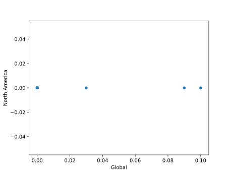

# Análise de vendas de jogos eletrônicos

Análise exploratória feita como um trabalho para a matéria princípios da ciência de dados do curso de ciência de dados da Fatec de Cotia 
O dataset utilizado pode ser encontrado em: [videogames-sales-dataset](https://www.kaggle.com/datasets/sidtwr/videogames-sales-dataset/data)

## O dataset

O dataset foi criado através de um processo de scrapping do site do VGChartz que é uma empresa que agrega informações sobre o mercado de videogames. Nesse trabalhos utilizaremos somente os dados sobre jogos no console PlayStation 4 (arquivo "PS4_GamesSales.csv"), quando nos referirmos ao "dataset" estamos falando apenas dos jogos de PS4.

Os dados estão organizados em uma tabela, cada linha contém informações sobre um jogo como nome ("Game"), ano de lançamento ("Year"), gênero ("Genre"), empresa desenvolvedora/publicadora ("Publisher") e o número de milhões de unidades vendidas globalmente e também separado nos subconjuntos América do Norte ("North America"), Europa ("Europe"), Japão ("Japan") e outros países ("Rest of World").

## Análise

### O problema do ano de lançamento
O dataset contém registro de 1034 jogos distintos, desses 209 não contém registro do ano de lançamento.

*(Tabela com a contagem de valores da coluna "Year", o ano "0.0" representa os registros com ano nulo).*
Ao observarmos o gráfico de dispersão das entre as colunas de vendas globais regionais dos 209 registros com ano nulo, percebemos que 206 registram 0 vendas globais.

*(Acima estão os gráficos de dispersão entre a coluna de vendas globais e vendas por região dos 209 registros com ano nulo, note que 206 registros têm vendas globais zeradas).*

*(Acima estão os gráficos de dispersão entre a coluna de vendas globais e vendas por região dos 825 registros com ano preenchido).*
A ausência de ano de lançamento e a diferença entre o número de vendas dos registros que possuem ano de lançamento indica que os dados desses 209 registros sem ano de lançamento podem ter qualidade comprometida e são excluidos das análises a partir daqui.

### O restante
Ao olharmos para os boxplots da colunas com os números de vendas dos 825 registros restantes percebemos a concentração de registros com baixos números de vendas.

*(Boxplots para as colunas com o número de milhões de unidades vendidas, o triângulo verde indica a posição da média enquanto a barra horizontal verde indica a posição da mediana)*
|   |mediana|média|máximo|mínimo|
|---|---|---|---|---|
|Global|0.12|0.72|19.39|0|
|North America|0.05|0.25|6.18|0|
|Europe|0.02|0.31|9.71|0|
|Japan|0.0|0.04|2.17|0|
|Rest of World|0.02|0.11|3.02|0|

Ao eliminarmos os outliers da coluna "Global" o conjunto de dados resultante contém 690 jogos que são utilizados para as análises a partir daqui.

### ...

Os dados estão com discrepâncias menores, porém ainda temos uma concentração grande de jogos que veram poucas unidades, note que pelo menos metade dos registros venderam zero unidades no Japão e Europa.
|   |mediana|média|máximo|mínimo|
|---|---|---|---|---|
|Global|0.07|0.183|1.06|0|
|North America|0.03|0.069|0.86|0|
|Europe|0.0|0.065|0.68|0|
|Japan|0.0|0.021|0.39|0|
|Rest of World|0.01|0.027|0.2|0|

*(Histogramas para as colunas com o número de milhões de unidades vendidas)*
Note que a quantidade de registros com baixos números de vendas vária de acordo com a região sendo que o "resto do mundo" é o grupo que mais se assemelha ao padrão global.
Nem todo jogo eletrônico está oficialmente disponível para todas os países, acreditamos que isso possa explicar o grande número de registros com zero vendas no Japão e Europa, Améria do Norte é um mercado muito atrativo para a maioria das desenvolvedoras e o "resto do mundo" incluí diversos países em diferentes regiões e isso dificulta que um jogo registre zero vendas nessas regiões.

